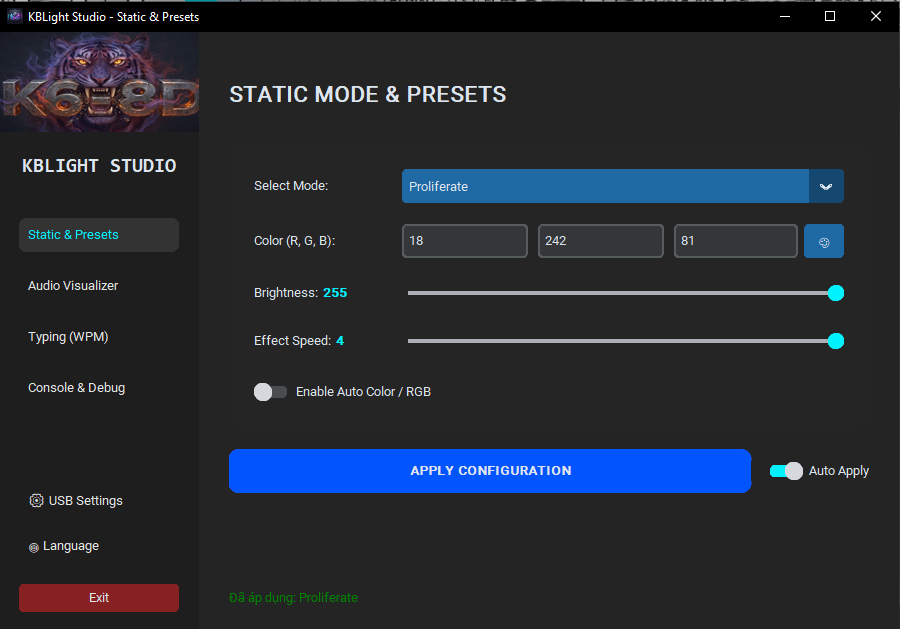
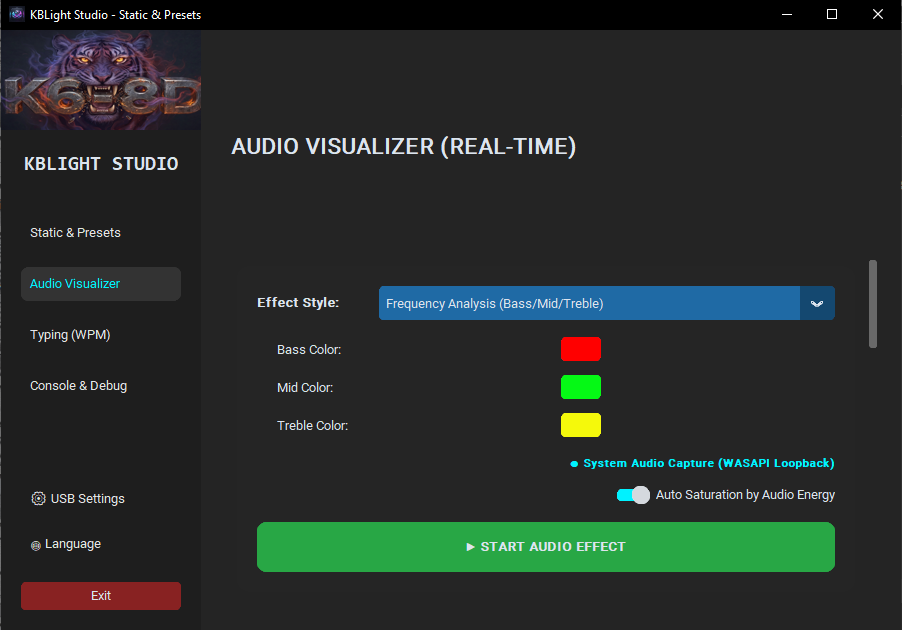
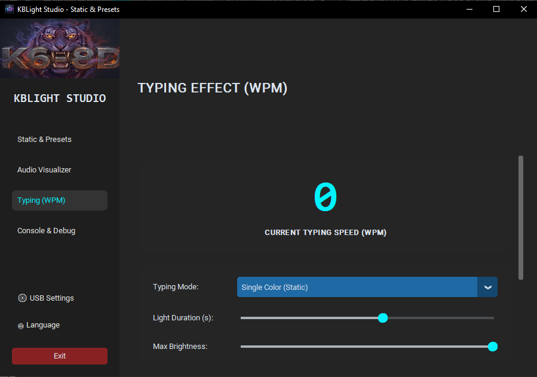

# ⌨️ Atas-K68D-Custom

<div align="center">
  <p><strong>A Modern, Open-Source, Non-Commercial Custom Keyboard Lighting Controller.</strong></p>
  <p>
    <a href="README.vi.md">🇻🇳 Đọc bằng Tiếng Việt (Read in Vietnamese)</a>
  </p>
</div>

---

**Atas-K68D-Custom** is a Python-based desktop application designed to control and customize the LED lighting of compatible custom mechanical keyboards over USB HID. It features a sleek, dark-themed GUI built with `customtkinter` and brings advanced lighting capabilities to your desktop, including real-time audio visualization and typing reactivity.

> **⚠️ Open Source & Non-Commercial Notice**  
> This project is open-source but **STRICTLY NOT FOR COMMERCIAL USE**. You are free to download, study, modify, and use this software for your personal setup, but you may not sell or re-distribute it for profit.

---

## ☕ Support the Creator

This project is developed and maintained by a single individual in their free time. If you find Atas-K68D-Custom useful and it brings joy to your workspace, consider buying me a coffee! Your support helps keep the project alive and motivates further updates.

[](https://buymeacoffee.com/hthan24)

Thank you for your support! ❤️

---

## ✨ Key Features

- **🎨 Static & Animated Modes**: Easily switch between built-in hardware animations (Wave, Spectrum, Breathe, Neon, etc.) or set static custom colors using an intuitive color picker.
- **🎵 Real-time Audio Visualizer**: Turn your keyboard into a dynamic spectrum analyzer. It reacts to your system's audio output with advanced features like "Smart Pitch" (frequency to Hue mapping) and "Auto Saturation".
- **⌨️ Typing Monitor (WPM)**: Your keyboard lighting reacts to your typing speed! The faster you type, the more intense the LED effects become.
- **🌍 Full Multi-Language Support**: Currently supports English, Vietnamese, Chinese, and Russian out-of-the-box.
- **🔌 Plug & Play**: Automatically detects and connects to the configured keyboard via USB HID (Default: VID `0x5566`, PID `0x000A`).
- **📥 Dynamic Language Module**: Easily add your own native language by simply dropping a `.json` file into the `languages/` folder!

---

## 🎥 Real-time Video Demo

<div align="center">
  <p>See Atas-K68D-Custom in action with real-time reactive Audio Visualizer effects:</p>
  <table style="width:100%; table-layout:fixed;">
    <tr>
      <td align="center">
        <video src="DOCS/example_video/7604113601169.mp4" controls muted loop autoplay style="max-width:100%; border-radius:10px;"></video>
      </td>
      <td align="center">
        <video src="DOCS/example_video/7604113221845.mp4" controls muted loop autoplay style="max-width:100%; border-radius:10px;"></video>
      </td>
    </tr>
    <tr>
      <td align="center"><b>🎵 Demo 1: Audio Visualizer</b></td>
      <td align="center"><b>🎵 Demo 2: Audio Visualizer</b></td>
    </tr>
  </table>
</div>

---

---

## 📸 Screenshots

### 1. Static Lighting & Built-in Modes
Control your basic LED modes, adjust brightness, speed, and pick exact hex colors.
<br>


### 2. Audio Visualizer
Customize how the keyboard reacts to music and system sounds.
<br>


### 3. Application Settings & Multi-language
Configure startup behaviors, check USB connection status, and switch interface languages.
<br>


---

## 🚀 Quick Start (For Everyone)

### ⭐ **Easiest Option: Download Pre-built Release**

The simplest way to get started is to download the pre-built executable from our [Releases page](https://github.com/Hthancder/Atas-K68D-Custom/releases):

1. **Go to [Releases](https://github.com/Hthancder/Atas-K68D-Custom/releases)** and find the latest release.
2. **Download the appropriate file for your operating system**:
   - **Windows**: `Atas-K68D-Custom.exe` or `.zip` file
   - **macOS/Linux**: in developing
3. **Run the downloaded file** - no installation needed! Just double-click and go.
4. **Connect your keyboard** via USB - the app will automatically detect it.
5. **Start customizing** your keyboard lighting! 🎨

> **No coding knowledge required!** This option is perfect for users who just want to use the application.

---

## 💻 Installation & Setup (For Developers)

If you want to modify the code, contribute, or run from source, follow these instructions:

### Prerequisites
- **Python 3.8+** installed on your system.
- *(Windows)* Standard USB HID drivers (usually works out-of-the-box, but `hidapi` requires access to the device).

### 1. Clone or Download the Repository
```bash
git clone https://github.com/Hthancder/Atas-K68D-Custom.git
cd Atas-K68D-Custom
```

### 2. Install Dependencies
Install all required Python libraries via `pip`:
```bash
pip install -r requirements.txt
```

### 3. Run the Application
Launch the app by running the main entry point:
```bash
python main.py
```
*(Tip: On Windows, you can rename `main.py` to `main.pyw` or run it with `pythonw` to hide the console window).*

---

## ⚙️ Configuration

If your keyboard uses a different Vendor ID (VID) or Product ID (PID), you can change it directly in the app's **Settings Tab** or by manually editing `settings.json` in the project root:

```json
{
    "target_vid": "0x5566",
    "target_pid": "0x000A"
}
```

---

## 🌍 How to Add Your Own Language

Atas-K68D-Custom uses a dynamic JSON-based translation system. You can easily translate the app into your native language!

1. Navigate to the `languages/` directory.
2. Make a copy of the `template_translate.json` file.
3. Rename the copied file to your language code (e.g., `es.json` for Spanish, `ja.json` for Japanese).
4. Open the file in any text editor.
5. Edit the `_meta` block to reflect your language's name and your author name.
6. Translate the English values on the right side of the `translations` dictionary.
7. Restart Atas-K68D-Custom. Your language will automatically appear in the Language Selection dialog!

---

## 📖 USB Protocol Documentation

For developers and hardware enthusiasts interested in how the keyboard communication works under the hood, check out the `Packet_docs/` directory. It contains our reverse-engineered documentation of the 64-byte USB HID payload structures, handshakes, and hex commands used by the ATAS K68 and similar keyboard models.

---

## 📜 License

This project is released under an **Open Source, Non-Commercial License**. 

You are free to use, modify, and share this code for personal and educational purposes. **Commercial use, resale, or inclusion in paid products is strictly prohibited.** By using this software, you agree to these terms.
