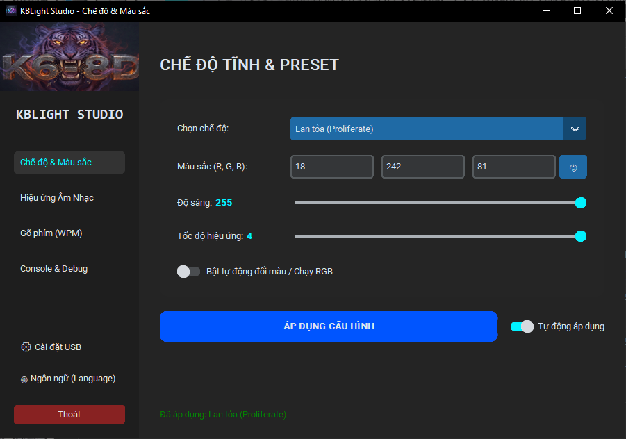
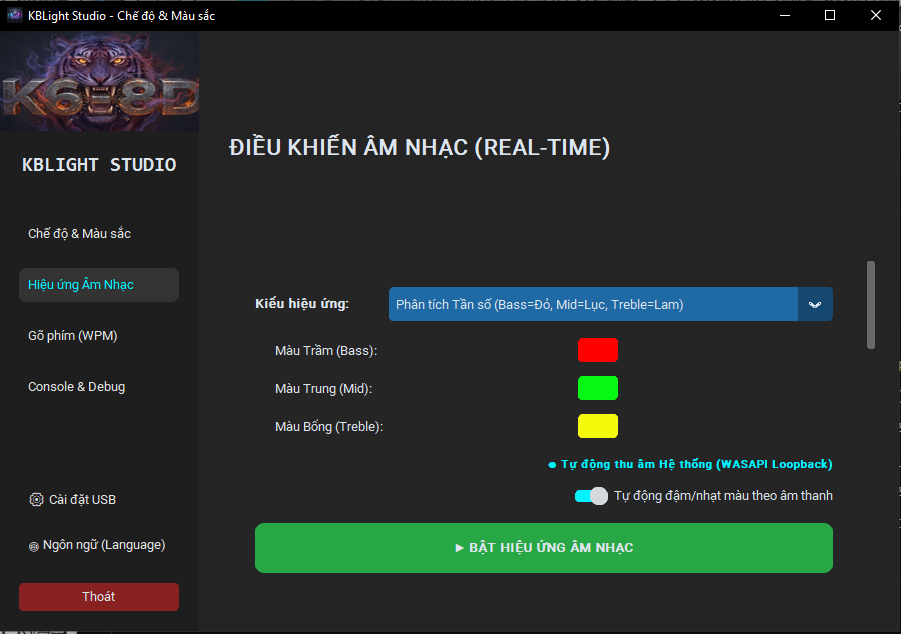
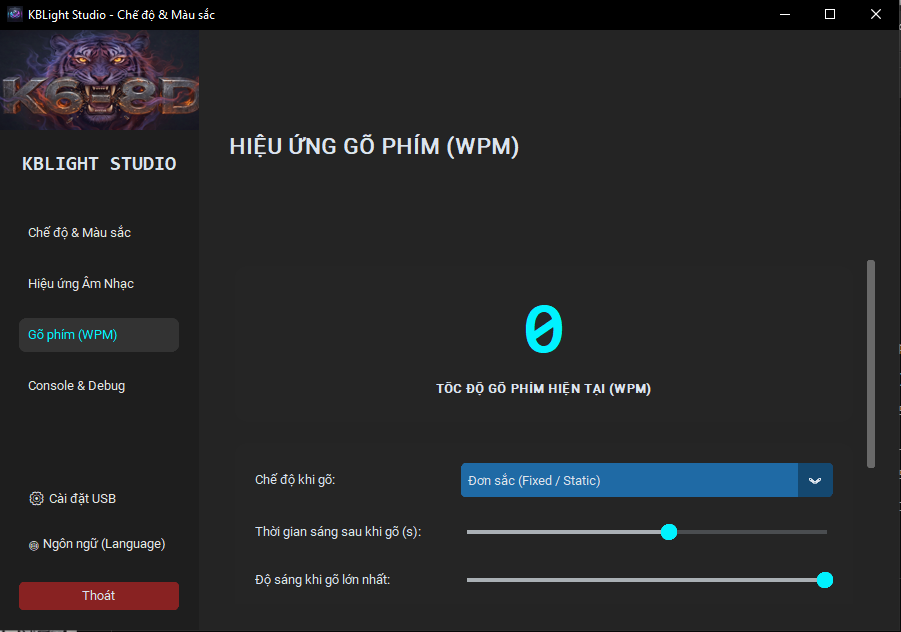

# ⌨️ Atas-K68D-Custom

<div align="center">
  <p><strong>Phần mềm Điều khiển LED Bàn phím Cơ Custom Hiện đại, Mã nguồn mở, Phi thương mại.</strong></p>
  <p>
    <a href="README.md">🇬🇧 Read in English (Đọc bằng Tiếng Anh)</a>
  </p>
</div>

---

**Atas-K68D-Custom** là một ứng dụng desktop viết bằng Python được thiết kế để điều khiển và tùy chỉnh hiệu ứng đèn LED của các bàn phím cơ custom tương thích thông qua giao thức USB HID. Với giao diện người dùng giao diện tối (dark-theme) hiện đại được xây dựng bằng `customtkinter`, ứng dụng mang đến các tính năng ánh sáng nâng cao cho góc làm việc của bạn, bao gồm hiệu ứng nháy theo nhạc thời gian thực và phản hồi tốc độ gõ phím.

> **⚠️ Lưu ý: Mã nguồn mở & Phi thương mại**  
> Dự án này là mã nguồn mở nhưng **NGHIÊM CẤM SỬ DỤNG CHO MỤC ĐÍCH THƯƠNG MẠI**. Bạn có toàn quyền tải về, nghiên cứu, sửa đổi và sử dụng phần mềm này cho góc máy cá nhân, nhưng bạn không được phép bán hoặc phân phối lại để kiếm lời.

---

## ☕ Ủng Hộ Nhà Sáng Tạo

Dự án này được phát triển và duy trì bởi một cá nhân trong thời gian rảnh rỗi. Nếu bạn thấy Atas-K68D-Custom hữu ích và làm đẹp thêm cho góc làm việc của mình, hãy cân nhắc mời mình một ly cà phê nhé! Sự ủng hộ của bạn là động lực rất lớn để mình tiếp tục duy trì và cập nhật dự án.

[](https://buymeacoffee.com/hthan24)

Cảm ơn bạn rất nhiều vì đã ủng hộ! ❤️

---

## ✨ Tính Năng Nổi Bật

- **🎨 Chế độ Tĩnh & Hiệu ứng Động**: Dễ dàng chuyển đổi giữa các hiệu ứng LED phần cứng có sẵn (Wave, Spectrum, Breathe, Neon, v.v.) hoặc đặt màu tĩnh tùy chỉnh bằng bảng chọn màu trực quan.
- **🎵 Hiệu ứng Nháy Theo Nhạc (Audio Visualizer)**: Biến bàn phím của bạn thành một bộ phân tích phổ âm thanh sống động. LED sẽ phản hồi với âm thanh hệ thống cùng các tính năng nâng cao như "Smart Pitch" (ánh xạ tần số sang dải màu Hue) và "Auto Saturation".
- **⌨️ Hiệu ứng Tốc Độ Gõ (WPM)**: Đèn LED bàn phím phản hồi theo tốc độ gõ của bạn! Bạn gõ càng nhanh, hiệu ứng LED càng trở nên mãnh liệt.
- **🌍 Hỗ Trợ Đa Ngôn Ngữ**: Mặc định hỗ trợ Tiếng Việt, Tiếng Anh, Tiếng Trung và Tiếng Nga.
- **🔌 Cắm là Chạy (Plug & Play)**: Tự động phát hiện và kết nối với bàn phím thông qua USB HID (Mặc định: VID `0x5566`, PID `0x000A`).
- **📥 Module Ngôn Ngữ Tùy Chỉnh**: Dễ dàng thêm ngôn ngữ mẹ đẻ của riêng bạn bằng cách thả file `.json` vào thư mục `languages/`!

---

## 📸 Ảnh Chụp Màn Hình

### 1. Chế độ Tĩnh & Hiệu ứng Mặc định
Điều khiển các chế độ LED cơ bản, điều chỉnh độ sáng, tốc độ và chọn mã màu chính xác.
<br>


### 2. Hiệu ứng Nháy Theo Nhạc
Tùy chỉnh cách bàn phím phản hồi với âm nhạc và âm thanh hệ thống.
<br>


### 3. Cài đặt & Đa ngôn ngữ
Cấu hình khởi động, kiểm tra trạng thái kết nối USB và chuyển đổi ngôn ngữ giao diện.
<br>


---

## 🚀 Hướng Dẫn Nhanh (Cho Mọi Người)

### ⭐ **Lựa Chọn Dễ Nhất: Tải Bản Phát Hành Có Sẵn**

Cách đơn giản nhất để bắt đầu là tải bản thực thi được biên dịch sẵn từ trang [Releases](https://github.com/Hthancder/Atas-K68D-Custom/releases) của chúng tôi:

1. **Truy cập [Releases](https://github.com/Hthancder/Atas-K68D-Custom/releases)** và tìm phiên bản mới nhất.
2. **Tải file phù hợp với hệ điều hành của bạn**:
   - **Windows**: `Atas-K68D-Custom.exe` hoặc file `.zip`
   - **macOS/Linux**: đang phát triển, mong muốn sự đóng góp và pull request !
3. **Chạy file đã tải** - không cần cài đặt gì! Chỉ cần bấm đôi chuột vào file.
4. **Kết nối bàn phím của bạn** thông qua USB - ứng dụng sẽ tự động nhận diện nó.
5. **Bắt đầu tùy chỉnh** hiệu ứng LED bàn phím! 🎨

> **Không cần biết lập trình!** Phương pháp này là hoàn hảo cho những ai chỉ muốn sử dụng ứng dụng mà không cần chỉnh sửa mã.

---

## 💻 Hướng Dẫn Cài Đặt (Cho Các Nhà Phát Triển)

Nếu bạn muốn sửa đổi mã, đóng góp hoặc chạy từ mã nguồn, hãy làm theo các hướng dẫn này:

### Yêu cầu hệ thống
- Đã cài đặt **Python 3.8+**.
- *(Windows)* Driver USB HID tiêu chuẩn (thường hệ điều hành tự nhận, nhưng thư viện `hidapi` cần quyền truy cập vào thiết bị).

### 1. Tải Mã Nguồn
```bash
git clone https://github.com/Hthancder/Atas-K68D-Custom.git
cd Atas-K68D-Custom
```

### 2. Cài Đặt Thư Viện (Dependencies)
Cài đặt tất cả các thư viện Python cần thiết qua `pip`:
```bash
pip install -r requirements.txt
```

### 3. Chạy Ứng Dụng
Khởi chạy ứng dụng bằng lệnh:
```bash
python main.py
```
*(Mẹo: Trên Windows, bạn có thể đổi tên `main.py` thành `main.pyw` hoặc chạy bằng `pythonw` để ẩn cửa sổ console terminal).*  

---

## ⚙️ Cấu Hình Nâng Cao

Nếu bàn phím của bạn sử dụng Vendor ID (VID) hoặc Product ID (PID) khác, bạn có thể thay đổi trực tiếp trong **Tab Cài Đặt (Settings)** của ứng dụng hoặc bằng cách chỉnh sửa thủ công file `settings.json` trong thư mục gốc:

```json
{
    "target_vid": "0x5566",
    "target_pid": "0x000A"
}
```

---

## 🌍 Cách Thêm Ngôn Ngữ Của Riêng Bạn

Atas-K68D-Custom sử dụng hệ thống dịch dựa trên file JSON động. Bạn có thể dễ dàng dịch ứng dụng sang ngôn ngữ của mình!

1. Truy cập vào thư mục `languages/`.
2. Tạo một bản sao của file `template_translate.json`.
3. Đổi tên file vừa copy thành mã ngôn ngữ của bạn (Ví dụ: `es.json` cho tiếng Tây Ban Nha, `ja.json` cho tiếng Nhật).
4. Mở file bằng bất kỳ trình soạn thảo văn bản nào.
5. Chỉnh sửa khối `_meta` để phản ánh tên ngôn ngữ và tên tác giả (tên của bạn).
6. Dịch các giá trị tiếng Anh ở phía bên phải của từ điển `translations`.
7. Khởi động lại Atas-K68D-Custom. Ngôn ngữ của bạn sẽ tự động xuất hiện trong cửa sổ Chọn Ngôn Ngữ!

---

## 📖 Tài Liệu Giao Thức USB (Packet Docs)

Dành cho các nhà phát triển và những người đam mê phần cứng quan tâm đến cách thức giao tiếp với bàn phím hoạt động ở tầng thấp, hãy xem thư mục `Packet_docs/`. Thư mục này chứa các tài liệu phân tích ngược (reverse-engineering) về cấu trúc gói tin USB HID 64-byte, các chuỗi bắt tay (handshake) và các lệnh hex được sử dụng bởi ATAS K68 và các mẫu bàn phím tương tự.

---

## 📜 Giấy Phép (License)

Dự án này được phát hành dưới dạng **Mã nguồn mở, Giấy phép Phi thương mại**.

Bạn có quyền tự do sử dụng, sửa đổi và chia sẻ mã nguồn này cho mục đích cá nhân và giáo dục. **Nghiêm cấm mọi hành vi sử dụng thương mại, bán lại hoặc tích hợp vào các sản phẩm trả phí.** Khi sử dụng phần mềm này, bạn đồng ý với các điều khoản trên.
